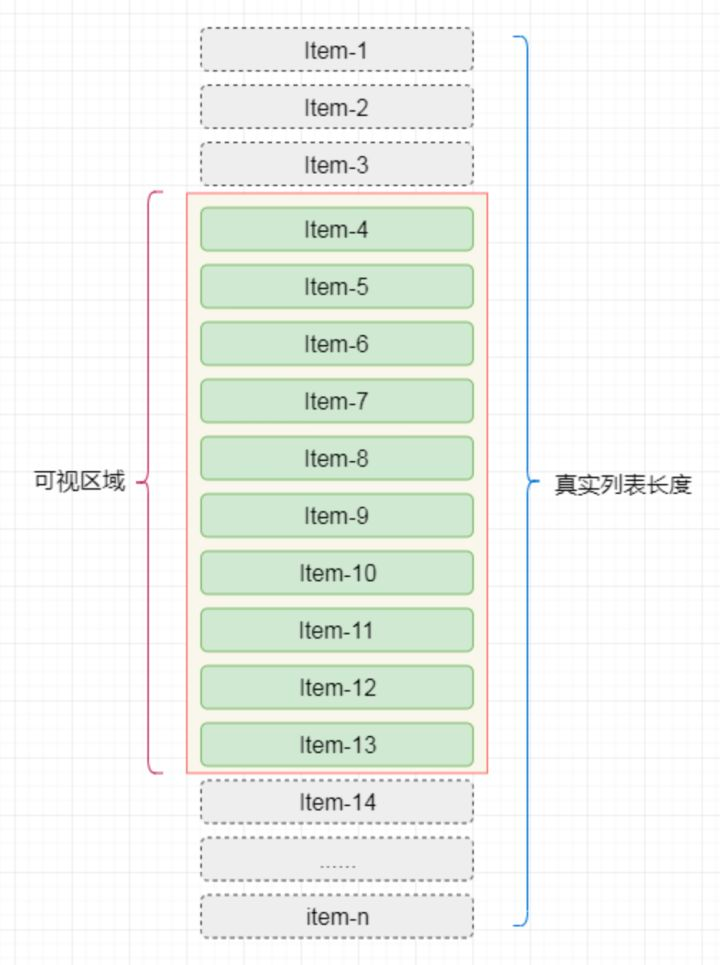

# react-virtual-notes 源码阅读

> 前言: 这次本来想解析 react-virtualized 的源码, 但是他的内容太多, 太杂, 我们先从小的库入手, 由点及面
> 所以这次改为了 react-virtual 和 react-window 的源码, 这篇就是 react-virtual

## 什么是虚拟列表

一个虚拟列表是指当我们有成千上万条数据需要进行展示但是用户的“视窗”（一次性可见内容）又不大时我们可以通过巧妙的方法只渲染用户最大可见条数+“BufferSize”个元素并在用户进行滚动时动态更新每个元素中的内容从而达到一个和长list滚动一样的效果但花费非常少的资源。



## 使用

最简单的使用例子:

```tsx
import {useVirtual} from "./react-virtual";

function App(props) {
    const parentRef = React.useRef()

    const rowVirtualizer = useVirtual({
        size: 10000,
        parentRef,
        estimateSize: React.useCallback(() => 35, []),
    })

    return (
        <>
            {/*这里就是用户的视窗*/}
            <div
                ref={parentRef}
                className="List"
                style={{
                    height: `150px`,
                    width: `300px`,
                    overflow: 'auto',
                }}
            >
                <div
                    className="ListInner"
                    style={{
                        height: `${rowVirtualizer.totalSize}px`,
                        width: '100%',
                        position: 'relative',
                    }}
                >
                    {/*具体要渲染的节点*/}
                    {rowVirtualizer.virtualItems.map(virtualRow => (
                        <div
                            key={virtualRow.index}
                            className={virtualRow.index % 2 ? 'ListItemOdd' : 'ListItemEven'}
                            style={{
                                position: 'absolute',
                                top: 0,
                                left: 0,
                                width: '100%',
                                height: `${virtualRow.size}px`,
                                transform: `translateY(${virtualRow.start}px)`,
                            }}
                        >
                            Row {virtualRow.index}
                        </div>
                    ))}
                </div>
            </div>
        </>
    )
}
```

`react-virtual` 库提供了最为关键的方法: `useVirtual` 我们就从这里来入手他的源码:

## useVirtual

我们先看他的用法之接受参数:

* `size: Integer`
    * 要渲染列表的数量(真实数量)
* `parentRef: React.useRef(DOMElement)`
    * 一个 ref, 通过这个来操控视窗元素, 获取视窗元素的一些属性
* `estimateSize: Function(index) => Integer`
    * 每一项的尺寸长度, 因为是函数, 可以根据 index 来返回不同的尺寸, 当然也可以返回常数
* `overscan: Integer`
    * 除了视窗里面默认的元素, 还需要额外渲染的, 避免滚动过快, 渲染不及时
* `horizontal: Boolean`
    * 决定列表是横向的还是纵向的
* `paddingStart: Integer`
    * 开头的填充高度
* `paddingEnd: Integer`
    * 末尾的填充高度
* `keyExtractor: Function(index) => String | Integer`
    * 只要启用了动态测量渲染，并且列表中的项目的大小或顺序发生变化，就应该传递这个函数。

这里也省略了很多 hook 类型的传参, 介绍了很多常用参数

hooks 返回结果:

* `virtualItems: Array<item>`
    * `item: Object`
    * 用来遍历的变量, 视窗中渲染的数量
* `totalSize: Integer`
    * 整个虚拟容器的大小, 可能会变化
* `scrollToIndex: Function(index: Integer, { align: String }) => void 0`
    * 一个调用方法, 可以动态跳转到某一个 item 上
* `scrollToOffset: Function(offsetInPixels: Integer, { align: String }) => void 0`
    * 同上, 不过传递的是偏移量

## 内部源码

```tsx
export function useVirtual({
                               size = 0,
                               estimateSize = defaultEstimateSize,
                               overscan = 1,
                               paddingStart = 0,
                               paddingEnd = 0,
                               parentRef,
                               horizontal,
                               scrollToFn,
                               useObserver,
                               initialRect,
                               onScrollElement,
                               scrollOffsetFn,
                               keyExtractor = defaultKeyExtractor,
                               measureSize = defaultMeasureSize,
                               rangeExtractor = defaultRangeExtractor,
                           }) {
    // 上面是传参, 这里就不多赘述


    // 判断是否是横向还是纵向
    const sizeKey = horizontal ? 'width' : 'height'
    const scrollKey = horizontal ? 'scrollLeft' : 'scrollTop'

    // ref 常用的作用, 用来存值
    const latestRef = React.useRef({
        scrollOffset: 0,
        measurements: [],
    })

    // 偏移量
    const [scrollOffset, setScrollOffset] = React.useState(0)
    latestRef.current.scrollOffset = scrollOffset // 记录最新的偏移量

    // useRect hooks 方法, 可通过传参覆盖
    // 作用是监听父元素的尺寸, 具体的 useRect 源码会放在下面
    const useMeasureParent = useObserver || useRect

    // useRect 的正式使用
    const {[sizeKey]: outerSize} = useMeasureParent(parentRef, initialRect)

    //  最新的父元素尺寸, 记录
    latestRef.current.outerSize = outerSize

    // 默认的滚动方法
    const defaultScrollToFn = React.useCallback(
        offset => {
            if (parentRef.current) {
                parentRef.current[scrollKey] = offset
            }
        },
        [parentRef, scrollKey]
    )

    // 被传值覆盖的一个操作
    const resolvedScrollToFn = scrollToFn || defaultScrollToFn

    // 添加 useCallback 包裹, 避免 memo 问题, 真实调用的函数
    scrollToFn = React.useCallback(
        offset => {
            resolvedScrollToFn(offset, defaultScrollToFn)
        },
        [defaultScrollToFn, resolvedScrollToFn]
    )

    // 缓存
    const [measuredCache, setMeasuredCache] = React.useState({})

    // 测量的方法, 置为空对象
    const measure = React.useCallback(() => setMeasuredCache({}), [])

    const pendingMeasuredCacheIndexesRef = React.useRef([])

    // 计算测量值
    const measurements = React.useMemo(() => {
        // 循环的最小值, 判断 pendingMeasuredCacheIndexesRef 是否有值, 有则使用其中最小值, 不然就是 0
        const min =
            pendingMeasuredCacheIndexesRef.current.length > 0
                ? Math.min(...pendingMeasuredCacheIndexesRef.current)
                : 0
        // 取完一次值之后置空
        pendingMeasuredCacheIndexesRef.current = []

        // 取 latestRef 中的最新测量值, 第一次渲染应该是 0, slice 避免对象引用
        const measurements = latestRef.current.measurements.slice(0, min)

        // 循环 measuredSize从缓存中取值, 计算每一个 item 的开始值, 和加上尺寸之后的结束值
        for (let i = min; i < size; i++) {
            const key = keyExtractor(i)
            const measuredSize = measuredCache[key]
            // 开始值是前一个值的结束, 如果没有值, 取填充值(默认 0
            const start = measurements[i - 1] ? measurements[i - 1].end : paddingStart
            // item 的高度, 这里就是上面所说的动态高度
            const size =
                typeof measuredSize === 'number' ? measuredSize : estimateSize(i)
            const end = start + size
            // 最后加上缓存
            measurements[i] = {index: i, start, size, end, key}
        }
        return measurements
    }, [estimateSize, measuredCache, paddingStart, size, keyExtractor])

    // 总的列表长度
    const totalSize = (measurements[size - 1]?.end || paddingStart) + paddingEnd

    // 赋值给latestRef
    latestRef.current.measurements = measurements
    latestRef.current.totalSize = totalSize

    // 判断滚动元素, 可以从 props 获取, 默认是父元素的滚动
    const element = onScrollElement ? onScrollElement.current : parentRef.current

    // 滚动的偏移量获取函数, 有可能为空
    const scrollOffsetFnRef = React.useRef(scrollOffsetFn)
    scrollOffsetFnRef.current = scrollOffsetFn

    //  判断是否有 window, 有的话则用 useLayoutEffect, 否则使用 useEffect
    useIsomorphicLayoutEffect(() => {
        // 如果滚动元素没有, 或者说没有渲染出来, 则返回
        if (!element) {
            setScrollOffset(0)

            return
        }

        // 滚动的函数
        const onScroll = event => {
            // 滚动的距离, 如果有传参数, 则使用, 否则就是用 parentRef 的
            const offset = scrollOffsetFnRef.current
                ? scrollOffsetFnRef.current(event)
                : element[scrollKey]

            // 这里使用 setScrollOffset 会频繁触发 render, 可能会造成性能问题, 后面再查看另外的源码时, 考虑有什么好的方案
            setScrollOffset(offset)
        }

        onScroll()

        // 添加监听
        element.addEventListener('scroll', onScroll, {
            capture: false,
            passive: true,
        })

        return () => { // 解除监听
            element.removeEventListener('scroll', onScroll)
        }
    }, [element, scrollKey])

    // 具体源码解析在下方, 作用是通过计算得出范围 start, end 都是数字
    const {start, end} = calculateRange(latestRef.current)

    // 索引, 计算最低和最高的显示索引 最后得出数字数组, 如 [0,1,2,...,20] 类似这样
    const indexes = React.useMemo(
        () =>
            rangeExtractor({
                start,
                end,
                overscan,
                size: measurements.length,
            }),
        [start, end, overscan, measurements.length, rangeExtractor]
    )

    // 传值measureSize, 默认是通过元素获取 offset
    const measureSizeRef = React.useRef(measureSize)
    measureSizeRef.current = measureSize

    // 真实视图中显示的元素, 会返回出去
    const virtualItems = React.useMemo(() => {
        const virtualItems = []
        // 根据索引循环 indexex 类似于 [0,1,2,3,...,20]
        for (let k = 0, len = indexes.length; k < len; k++) {
            const i = indexes[k]

            // 这里是索引对应的数据集合, 有开始尺寸,结束尺寸, 宽度, key等等
            const measurement = measurements[i]

            // item 的数据
            const item = {
                ...measurement,
                measureRef: el => {
                    // 额外有一个 ref, 可以不使用
                    // 一般是用来测量动态渲染的元素
                    if (el) {
                        const measuredSize = measureSizeRef.current(el, horizontal)

                        // 真实尺寸和记录的尺寸不同的时候, 更新
                        if (measuredSize !== item.size) {
                            const {scrollOffset} = latestRef.current

                            if (item.start < scrollOffset) {
                                // 滚动
                                defaultScrollToFn(scrollOffset + (measuredSize - item.size))
                            }

                            pendingMeasuredCacheIndexesRef.current.push(i)

                            setMeasuredCache(old => ({
                                ...old,
                                [item.key]: measuredSize,
                            }))
                        }
                    }
                },
            }

            virtualItems.push(item)
        }

        return virtualItems
    }, [indexes, defaultScrollToFn, horizontal, measurements])

    // 标记是否 mounted,  就是平常使用的 useMount
    const mountedRef = React.useRef(false)

    useIsomorphicLayoutEffect(() => {
        if (mountedRef.current) {
            setMeasuredCache({})
        }
        mountedRef.current = true
    }, [estimateSize])

    const scrollToOffset = React.useCallback(
        (toOffset, {align = 'start'} = {}) => {
            const {scrollOffset, outerSize} = latestRef.current

            if (align === 'auto') {
                if (toOffset <= scrollOffset) {
                    align = 'start'
                } else if (toOffset >= scrollOffset + outerSize) {
                    align = 'end'
                } else {
                    align = 'start'
                }
            }

            if (align === 'start') {
                scrollToFn(toOffset)
            } else if (align === 'end') {
                scrollToFn(toOffset - outerSize)
            } else if (align === 'center') {
                scrollToFn(toOffset - outerSize / 2)
            }
        },
        [scrollToFn]
    )

    const tryScrollToIndex = React.useCallback(
        (index, {align = 'auto', ...rest} = {}) => {
            const {measurements, scrollOffset, outerSize} = latestRef.current

            const measurement = measurements[Math.max(0, Math.min(index, size - 1))]

            if (!measurement) {
                return
            }

            if (align === 'auto') {
                if (measurement.end >= scrollOffset + outerSize) {
                    align = 'end'
                } else if (measurement.start <= scrollOffset) {
                    align = 'start'
                } else {
                    return
                }
            }

            const toOffset =
                align === 'center'
                    ? measurement.start + measurement.size / 2
                    : align === 'end'
                        ? measurement.end
                        : measurement.start

            scrollToOffset(toOffset, {align, ...rest})
        },
        [scrollToOffset, size]
    )

    const scrollToIndex = React.useCallback(
        (...args) => {
            // We do a double request here because of
            // dynamic sizes which can cause offset shift
            // and end up in the wrong spot. Unfortunately,
            // we can't know about those dynamic sizes until
            // we try and render them. So double down!
            tryScrollToIndex(...args)
            requestAnimationFrame(() => {
                tryScrollToIndex(...args)
            })
        },
        [tryScrollToIndex]
    )

    return {
        virtualItems,
        totalSize,
        scrollToOffset,
        scrollToIndex,
        measure,
    }
}


```

## calculateRange

```tsx
function calculateRange({measurements, outerSize, scrollOffset}) {
    const size = measurements.length - 1
    const getOffset = index => measurements[index].start

    // 通过二分法找到 scrollOffset 对应的值
    let start = findNearestBinarySearch(0, size, getOffset, scrollOffset)
    let end = start

    // 类似于 通过比例计算出最后的 end 数值
    while (end < size && measurements[end].end < scrollOffset + outerSize) {
        end++
    }

    return {start, end}
}
```

## 引用

- https://react-virtual.tanstack.com/docs/overview
- https://zhuanlan.zhihu.com/p/366416646
